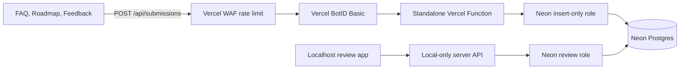

# Secure Shared Submission System

## Target architecture

- Keep the main Next.js site statically exported; use a root-level standalone function at [`api/submissions.js`](api/submissions.js), not `pages/api`, so the old Next.js runtime is not turned into a public server.
- Remove the GitHub Pages deployment workflow at [`.github/workflows/nextjs.yml`](.github/workflows/nextjs.yml). GitHub remains the source repository, while Vercel remains the only public host.
- Keep the review app under [`tools/submissions-admin/`](tools/submissions-admin/) and outside [`pages/`](pages/), so it is never routed or built as part of the public site. Add an automated preview check that `/admin` and any submission-listing endpoint return 404 publicly.

## 1. Establish the Neon data boundary

- Add a versioned SQL migration such as [`db/migrations/001_user_submissions.sql`](db/migrations/001_user_submissions.sql) for one `user_submissions` table rather than three near-duplicate tables.
- Use a constrained `kind` value (`faq_question`, `roadmap_suggestion`, `site_feedback`) plus common fields: UUID, optional subject, plain-text message, optional contact email, source path, moderation status, reviewer notes, idempotency key, and timestamps. Index status/kind with newest-first review queries.
- Default every entry to `new`; nothing submitted by a visitor is ever rendered publicly or automatically promoted.
- Create roles with SQL, not the Neon Console’s elevated default role:
  - Vercel writer: `INSERT` only on this table.
  - Local reviewer: `SELECT` plus column-limited `UPDATE` for status, notes, and review timestamps; no schema privileges.
  - Migration/admin credential: local setup only.
- Put only the writer connection string in Vercel as `SUBMISSIONS_DATABASE_URL`; keep `SUBMISSIONS_REVIEW_DATABASE_URL` in the local admin app’s ignored `.env.local`. Neither is `NEXT_PUBLIC_*`. Use a separate Neon preview branch/credential so tests never pollute production.
- Store code and migrations in GitHub, but never database exports, credentials, raw IP addresses, or submission content.

## 2. Build one reusable public experience

- Add a shared composed shell and form under [`components/submissions/`](components/submissions/) with route-specific copy/config in [`data/submission-types.js`](data/submission-types.js). Reuse field rendering, validation messages, loading/success states, accessibility, and API calls; let each route compose its own static content around the form.
- Replace the placeholder in [`pages/feedback.js`](pages/feedback.js), and add [`pages/faq.js`](pages/faq.js) and [`pages/roadmap.js`](pages/roadmap.js). FAQ and roadmap content remains curated static content; their visitor forms only enter the moderation queue.
- Accept anonymous submissions with an optional email and a short privacy explanation. Do not collect a name, account, attachment, or rich HTML in v1.
- Cross-link the three contribution pages through the shared page shell and add discoverability through [`components/explorer/FooterViewport.js`](components/explorer/FooterViewport.js) without changing the frozen legacy footer component.

## 3. Implement the single secure write endpoint

- Share one strict schema between client and server (for example Zod), but treat server validation as authoritative: allowlisted kind, known keys only, normalized plain text, sensible length limits, valid optional email, small JSON body, and no file uploads.
- In [`api/submissions.js`](api/submissions.js), allow only `POST`, require same-origin browser requests, leave CORS closed, reject oversized/malformed bodies, verify BotID, discard honeypot hits, enforce a client-generated UUID idempotency key with a database unique constraint, and insert with parameterized SQL.
- Initialize BotID once from the public app shell in [`pages/_app.js`](pages/_app.js); use Basic mode initially because it is free on all Vercel plans. Add the required proxy rewrites in [`vercel.json`](vercel.json).
- Configure a Vercel WAF rule specifically for `POST /api/submissions`: begin in log mode at a generous threshold, review real traffic, then enforce a fixed-window IP limit (initial target: about 5 submissions per 10 minutes). Keep Vercel’s automatic DDoS protection as the outer layer and reserve paid BotID Deep Analysis for persistent sophisticated spam.
- Use the Neon HTTP driver for this one-query, low-volume endpoint and the restricted writer role. Return stable 201/4xx/429 responses without leaking database or bot-classification details; log only outcome, kind, generated ID, and error class—not message or email.

## 4. Add the localhost-only moderation app

- Build a small second local Next app in [`tools/submissions-admin/`](tools/submissions-admin/) and launch it with an `npm run submissions:admin` script bound to `127.0.0.1` on a separate port.
- Its browser calls only its own localhost API; the Neon review credential stays server-side. Enforce same-origin/CSRF checks even locally and do not enable CORS.
- Support paginated filtering by kind, status, and date; detail viewing; optional-email visibility; reviewer notes; and status changes such as `new`, `reviewed`, `accepted`, `declined`, `spam`, and `archived`. Avoid hard deletion and public publishing in v1.
- Reuse the shared submission constants and database helpers where safe, while keeping public write logic and reviewer permissions separate. Add ignores for nested build output, local env files, and optional CSV exports.

## 5. Verify and roll out safely

- Add unit tests for all three form configurations, strict validation, normalization, idempotency, and status transitions; endpoint tests for wrong methods, cross-origin requests, malformed/oversized payloads, honeypots, BotID failures, and database failures.
- Add browser checks for keyboard/accessibility behavior and success/error/retry states on FAQ, roadmap, and feedback pages, plus local-admin filtering and moderation.
- First deploy a preview and confirm Vercel reports the site as static assets plus exactly the intended write function; confirm there is no public read/admin route and no secret in client bundles. If the current project setting does not emit a root function alongside the export, move only that function into a Vercel Service while preserving the same endpoint and security boundary.
- Apply the migration and grants to the preview Neon branch, test end to end, then production. Run the WAF rule in log mode before enforcement and document credential rotation, spam triage, and rollback in [`docs/submissions-operations.md`](docs/submissions-operations.md).